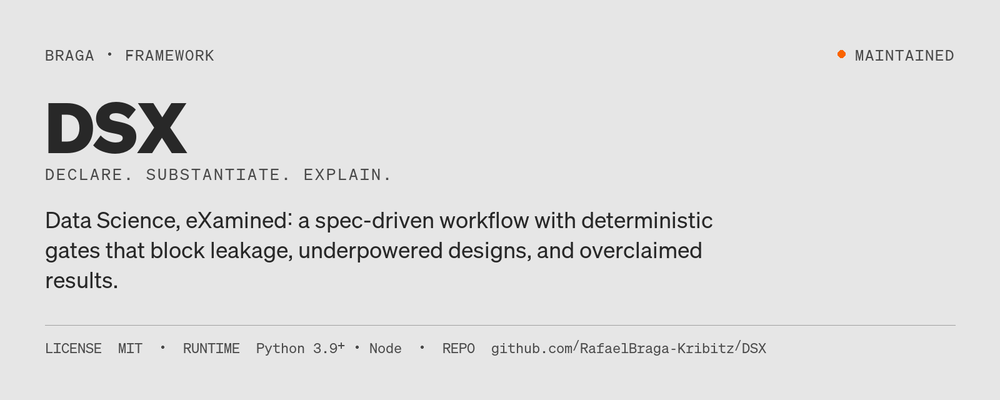
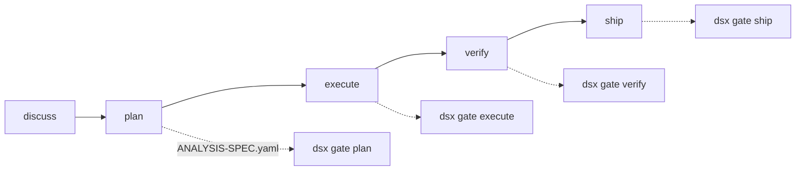

# DSX



[](LICENSE)
[](#status)

**Status:** Maintained · **DSX — Data Science, eXamined** · Python 3.9+ · MIT

Analytical work shipped through a generic agent loop still leaks, underpowers and
overclaims. DSX makes those errors blocking: code that runs at the gate, not
advice in a prompt. It runs standalone as a command-line tool, and installs as a
capability into [GSD Core](https://github.com/open-gsd/gsd-core) ≥ 1.6 to gate
that framework's phase loop.

> **Declare. Substantiate. eXplain.** Declare the analysis before the data is
> touched, substantiate it with code, publish only what the evidence supports.



---

## The idea

GSD solves context rot by running heavy work in fresh subagents against structured
artifacts. That machinery is domain-agnostic. What it does not know is that a
random train/test split on time-ordered data invalidates the model, that three
metrics tested at α = 0.05 carry a 14% family-wise error rate, or that a bar chart
starting at 40 exaggerates whatever it shows.

DSX supplies that knowledge — and, critically, supplies it as **code that
runs in blocking gates** rather than as advice in a prompt.

### Where the determinism goes

The split is deliberate and it is the whole design:

| | Stochastic (agent judgement) | Deterministic (code) |
|---|---|---|
| **What** | Filling `ANALYSIS-SPEC.yaml` — framing the question, choosing the design, defining the metric, writing the claim | Checking the spec is coherent and that the produced artifacts satisfy it |
| **Why** | These need context, domain knowledge and conversation with a human | These are decidable, and a decidable check should never be delegated to a model |

An agent decides that this is a causal question needing a difference-in-differences
design. Code then verifies that parallel-trends evidence was declared, that the
claim's verb matches the design's strength, that the sample meets the power the
declared MDE requires, and that no feature in the model is populated after the
outcome. The agent stays flexible; the output stops being a matter of opinion.

**Finding codes** across check families (contract, experiment, causal, stats, ML,
metrics/SQL, claims, narrative, code, decision, data quality, coherence,
visualization, reproducibility, paradigm/monitoring, validity frame,
interference, pre-registered inference, frequentist admissibility, chart
review), each with a stable identifier, a severity, evidence in numbers, and a
concrete fix.

---

## Install

```bash
git clone https://github.com/RafaelBraga-Kribitz/DSX.git
cd DSX
node install.mjs                 # --runtime cursor|codex|opencode|... , --local
```

Requires GSD Core ≥ 1.6 and Python 3.9+. **No third-party Python packages** — the
statistics kernel is stdlib-only, because a gate that breaks on a missing
dependency is a gate that gets turned off.

On Windows, if your checkout location is deep, clone with long paths enabled
(`git -c core.longpaths=true clone …`, or `git config --global core.longpaths true`):
the planning archives under `.planning/milestones/` carry paths up to ~135 characters
below the repository root, and Windows refuses paths beyond 260 without it.

The installer runs a self-test: it asserts the known-good fixture passes every
gate and the known-bad fixture is blocked by every gate. If either fails, the
install aborts.

```bash
node install.mjs --check         # verify an existing install
node install.mjs --uninstall
```

---

## Which path applies to you

`node install.mjs` installs the capability **once, globally, for the whole
machine** — it is not a per-project version. What varies per project is
whether [GSD Core](https://github.com/open-gsd/gsd-core) is running there at
all, and whether that project already has an `ANALYSIS-SPEC.yaml` written
against an older ruleset. Five starting points, and the path for each:

| Your situation | Path |
|---|---|
| **Brand-new project.** Nothing exists yet. | `/gsd-new-project` (bootstraps GSD) → `node install.mjs` (once per machine, skip if already installed) → `pwsh scripts/gsd-stamp.ps1 -Project . -Tier <N>` → set `dsx.require_spec true` if this is a pure analytics project → `/gsd-plan-phase`. |
| **Already being built**, but never used GSD or DSX. | Same as above, except use `/gsd-onboard` in place of `/gsd-new-project` — it maps the existing codebase and ingests any existing docs before anything is wired in. DSX gates apply from the next phase you plan onward; it does not retroactively judge code already written. |
| **Already runs GSD**, no DSX yet. | Skip the GSD bootstrap entirely. Install DSX globally if this machine doesn't have it yet, then `pwsh scripts/gsd-stamp.ps1 -Project .` to wire this project's skills, pick a tier (§3 of the [operating guide](docs/operating-guide.md)), and set `dsx.require_spec` if wanted. The next phase you plan picks up the gates; phases already shipped are untouched. |
| **Already built and shipped.** No active GSD phase running on it any more. | There is no phase loop left to gate. If you plan to keep evolving the project, treat it as "has GSD, no DSX" or "no GSD, no DSX" above, depending on what it already runs, and the gates cover future work only. If you instead want a trust check on the *finished* piece before calling it portfolio-grade, skip GSD entirely: write an `ANALYSIS-SPEC.yaml` describing what was actually done, then run `dsx audit --spec ANALYSIS-SPEC.yaml --verbose --report DATA-REVIEW.md` by hand (see [Standalone CLI](#standalone-cli)) and fix whatever it finds. |
| **Already on DSX, on an older version.** | Re-run `node install.mjs` — it overwrites the one global install and self-tests before committing, so there's nothing to do per project for the tool itself. What can lag is a project's *spec*: an `ANALYSIS-SPEC.yaml` written against an older ruleset can start failing gates it used to pass. Run `dsx audit` against every existing spec in that project; a newly-blocking finding is a version-delta, not a new bug in your work. Only one jump so far has been schema-breaking rather than additive — see [Migrating a pre-v2.0.0 spec](#migrating-a-pre-v200-spec) — and `suppressions[]` with a named authority is the documented interim path when a real fix needs more time. |

`gsd-stamp.ps1` requires `.planning/` to already exist, which is exactly the
marker that GSD has been bootstrapped on that project — it is the check that
tells "has GSD" apart from "does not" in the table above. Full mechanics for
rollout, tiers and propagating a DSX change to every project already using it
are in the [operating guide](docs/operating-guide.md).

---

## Architecture

The overlay does not fork [GSD Core](https://github.com/open-gsd/gsd-core). It
installs a capability whose gates are `command-exit-zero` predicates running
`dsx gate <point>`: exit 0 passes, exit 1 blocks the loop with the findings in
the gate message, exit 2 routes to the gate's `onError`. A spec judged bad
stops the loop; a spec that could not be read is an operational error — the
distinction matters, and the exit codes preserve it.

```text
  discuss ──▶ plan ──────▶ execute ──────▶ verify ──────▶ ship
               │             │               │              │
        ┌──────┴──────┐      │        ┌──────┴──────┐       │
        │ ANALYSIS-   │      │        │ STATS-      │       │
        │ SPEC.yaml   │      │        │ REVIEW.md   │       │
        └──────┬──────┘      │        └──────┬──────┘       │
               ▼             ▼               ▼              ▼
         ✋ gate plan   ✋ gate execute  ✋ gate verify  ✋ gate ship
         blocks at        blocks at       blocks at      blocks at
         CRITICAL         CRITICAL        HIGH           HIGH
```

**Phases with no `ANALYSIS-SPEC.yaml` pass through untouched**, so this is safe
to enable in a mixed repository. Set `dsx.require_spec true` in a pure analytics
project to make the spec mandatory.

Rollout, ceremony tiers, and the global-vs-per-project split are in the
[operating guide](docs/operating-guide.md). Why the gates, the stdlib statistics
kernel, and the YAML spec are shaped this way is under [Design notes](#design-notes).

### Repository structure

| Path | Responsibility |
|---|---|
| `capabilities/dsx/` | GSD capability manifest and gate wiring |
| `dsx/` | Python CLI, check families, stdlib statistics kernel |
| `agents/` | Six specialist agent briefs |
| `skills/` | Fourteen workflow skills |
| `templates/` | `ANALYSIS-SPEC.yaml` and the supporting templates |
| `examples/` | Known-good and known-bad fixtures (the install self-test) |
| `tests/` | `unittest` suite for every check family |
| `scripts/` | Installer helpers, catalogue generator, project stamp |
| `docs/` | Operating guide, tiers, literature notes |
| `references/` | Finding-code catalogue generated from source |

---

## The contract

`ANALYSIS-SPEC.yaml` is the deterministic input everything else is checked
against. It is written **before the data is touched** — that is not process
theatre, it is the only thing that distinguishes a decision rule from a
rationalisation.

```yaml
question_type: causal

decision:
  owner: "VP Growth"
  decision_rule: >
    Roll out if the 95% CI lower bound on uplift exceeds +1.0pp and no
    guardrail degrades beyond its tolerance.
  action_if_null: "Keep current onboarding; close the initiative."
  minimum_practical_effect: 0.02

design:
  kind: experiment
  randomization_unit: user
  analysis_unit: user
  baseline_rate: 0.31
  mde: 0.02
  alpha: 0.05
  power: 0.80
  planned_n_per_arm: 9000       # dsx computes what this MUST be
  peeking_policy: fixed_horizon
  multiplicity:
    family: [activation_rate, retention_d7, revenue_per_user]
    correction: benjamini_hochberg

claims:
  - text: "The checklist increases 7-day activation by 2.4pp (95% CI 1.0–3.8)"
    type: causal                # the verb must match the design's strength
    evidence: "RESULTS.md#uplift"
    population: "New non-bot signups, 2026-06-01 to 2026-06-14"
```

Run `dsx init` to scaffold it, `dsx vocab` to see every closed vocabulary.

### Migrating a pre-v2.0.0 spec

From v2.0.0, `validity_frame:` is required at the `plan` gate at CRITICAL
severity, so a v1.x spec blocks on upgrade. Fill the frame, or use
`suppressions[]` with a `reason` and a real `authority` as the interim path.
Full notes: [docs/CHANGELOG-notes.md](docs/CHANGELOG-notes.md#migrating-a-pre-v200-spec).

### The entrypoint leak scan now parses your code

Phase 11.1.1 moved `DSX-CODE-001` / `DSX-CODE-021` from text matching to a
Python AST read, with the old text scan as a labelled fallback. Some
docstring-only false alarms stop firing; some true leaks the old scan missed
now block. Every changed shape: [docs/CHANGELOG-notes.md](docs/CHANGELOG-notes.md#the-entrypoint-leak-scan-now-parses-your-code).

---

## What the gates actually catch

Real output, not a description of it:

```bash
$ dsx audit --spec examples/bad-ANALYSIS-SPEC.yaml

[CRITICAL] DSX-EXP-006  Experiment is underpowered: 1,200 per arm vs 47,528 required
    where:  spec.design.planned_n_per_arm
    detail: At baseline=0.08, MDE=0.005, alpha=0.05, the target power of 0.80
            needs 47,528 per arm. The plan is 97% short, delivering only 0.06
            power. The smallest effect actually detectable at 1,200 per arm is
            0.03382, which is 6.8x the declared MDE.
    fix:    Raise planned_n_per_arm to 47,528, raise the MDE to 0.03382, or
            extend the run until the sample is reached. Do not proceed and
            reinterpret a null as evidence of no effect.
```

That number is computed, not asserted. The same is true of the SRM chi-square,
the peeking-inflated α, the Benjamini-Hochberg adjustment, and the reconciliation
gap.

### The check families

| Family | Codes | Catches |
|---|---|---|
| **Contract** | `DSX-SPEC-*` | Missing decision rule, undefined denominators, duplicate metric names, unclassified claims |
| **Experiment** | `DSX-EXP-*` | Underpowering (computed), sample ratio mismatch (χ² tested), randomization/analysis unit mismatch, uncorrected multiplicity, peeking under a fixed-horizon design, sub-week duration, missing guardrails |
| **Causal** | `DSX-CAU-*` | Causal question with no identification strategy, strategies missing their required assumptions, weak strategies presented as strong |
| **Statistics** | `DSX-STA-*` | Test that does not match the outcome's shape, p-value with no effect size or interval, interval and p-value disagreeing, null accepted without an equivalence test, results that die under correction, significant-but-trivial effects |
| **ML integrity** | `DSX-ML-*` | Random split on temporal data, overlapping train/test periods, leaky feature names, preprocessing fitted before the split, resampling before the split, accuracy or ROC-AUC on an imbalanced target, no baseline, model losing to its baseline, train/test gap, test-set reuse, threshold tuned on test |
| **Metrics & SQL** | `DSX-MET-*` `DSX-SQL-*` | Undefined metrics in use, cross-source reconciliation beyond class/tolerance, denominator drift, Simpson's paradox, warehouse source without `sql`, join fan-out, `NOT IN` NULL traps, average-of-ratios, division without `NULLIF`, `= NULL`, `SELECT *`, `JOIN` without `ON`, `SUM(a/b)`, `BETWEEN` on timestamps |
| **Claims** | `DSX-CLM-*` | Causal verbs on an association claim, causal claims with no strategy, unhedged conclusions from weak identification, missing or unresolvable evidence pointers, claim numbers that do not overlap `results.tests`, relative `%` without a base, empty limitations on causal/prescriptive/predictive, overbroad generalisation, false precision against the interval |
| **Narrative** | `DSX-NAR-*` | Missing `narrative.path` at ship, claim text absent from deliverable, forbidden wording (`data proves`, …), relative `%` in narrative without base, missing `dashboard.path` |
| **Code reality** | `DSX-CODE-*` | Fit/transform before split, full-frame `StandardScaler().fit_transform`, SMOTE before split, model block with no split marker in entrypoint |
| **Decision replay** | `DSX-DEC-*` | Missing structured `decision.replay` at ship, metric missing from tests, replay FAIL, pass with non-significant primary p |
| **Data quality** | `DSX-DQ-*` | Assertions vs `DATA-PROFILE.yaml`: row count, PK uniqueness, null caps, time gaps, banned sentinels, manual profiles without gap notes |
| **Coherence** | `DSX-COH-*` | Claim type exceeding question type, causal decision language on descriptive questions, experiments missing MPE/`action_if_null`, empty assumptions, unchecked/unwaived assumptions |
| **Figure seals** | `DSX-FIG-*` | Missing artifacts, `svg_sha256` mismatch, unsealed paths at ship, glyph without seal, duplicate `chart_id`, FIGURE-MANIFEST coverage |
| **Plot smells** | `DSX-SMELL-*` | Dead series, density on atoms, stacked scenarios, category dropouts, self-correlation, disagreeing `run_id` |
| **Visualization** | `DSX-VIZ-*` | Truncated baselines on length-encoded charts, dual axes, chart type wrong for the relationship or data_input_type, takeaway = name, >5 pie slices, 3D, red/green as sole distinction, rainbow scales, estimates with no uncertainty, missing units |
| **Reproducibility** | `DSX-REP-*` | No seed on stochastic methods, unpinned environment, unidentifiable data extracts, missing entrypoint, notebooks not confirmed clean top-to-bottom, missing/`null`/incomplete `repro_lock` |
| **Paradigm & monitoring** | `DSX-PAR-*` | Declared inferential paradigm manifest; uncontrolled continuous peeking with no monitoring discipline declared, frequentist or Bayesian |
| **Validity frame** | `DSX-VAL-*` | Estimand missing attributes or non-discriminating, unit-triad mismatch, dependence with no admissible method, weak identification with no constraint, inconsistent sampling frame, missingness mechanism paired with an unlicensed method, unoperationalised measurement construct, unjustified exclusion rule |
| **Interference & stability** | `DSX-INT-*` | Interference/SUTVA risk with no mitigation, an inadmissible mitigation, triggered-vs-eligible dilution with no adjustment, novelty/primacy over the declared stability window |
| **Pre-registered inference** | `DSX-PRE-*` | Declared fallback rule that doesn't resolve, a pre-data plan that isn't what plan-time locked, executed procedure diverging from the declared branch, missing spec_id, an uncleared plan amendment |
| **Frequentist admissibility** | `DSX-ADM-*` | A declared procedure admissible but dominated by a cited ordering; no admissible procedure at all for the declared frame |
| **Chart review conformance** | `DSX-CRV-*` | Structural conformance of CHART-REVIEW.md — schema tag, the forbidden free-form scale, the terminal sentinel, finding-line traceability |

Full catalogue: [`references/finding-codes.md`](references/finding-codes.md) —
generated from the source, so it cannot drift from what the code emits.

---

## Agents and skills

Six specialists, each with a narrow adversarial brief:

| Agent | Role |
|---|---|
| `dsx-analysis-architect` | Turns a vague question into a checkable spec, before any data is touched |
| `dsx-statistician` | Adversarial review: magnitude, generalisation, alternative explanations |
| `dsx-ml-integrity-auditor` | Reads the pipeline code to verify it matches the spec's leakage claims |
| `dsx-metric-steward` | Definitions, reconciliation, SQL correctness |
| `dsx-viz-critic` | Encoding correctness and proportional geometry |
| `dsx-data-storyteller` | The decision-ready narrative, without outrunning the evidence |

14 skills covering the workflow end to end: `dsx-scope-analysis`,
`dsx-explore-data`, `dsx-design-experiment`, `dsx-define-metrics`,
`dsx-build-model`, `dsx-visualize`, `dsx-chart-audit`, `dsx-narrate`,
`dsx-review-analysis`, `dsx-cohort`, `dsx-funnel`, `dsx-root-cause`,
`dsx-segment` (four task playbooks that route marketing-analytics questions to
the existing gates instead of restating them), and `dsx-reproduce` (off-gate-path
re-run verification).

`dsx-chart-audit` is the standalone retroactive path: run `dsx check viz smells
figures`, spawn `dsx-viz-critic`, write scored `CHART-REVIEW.md`
(`schema: dsx-chart-review-v1`). Use when you need a figure audit without a full
experiment/ML readout.

### Finding suppressions

When a SPEC or ADR forbids the preferred fix (e.g. a mandated dual axis), declare:

```yaml
suppressions:
  - code: DSX-VIZ-030
    chart_id: a3_realized_vol
    reason: "AN-301 requires twin axes; change needs ADR"
    authority: "docs/SPEC-04_analytics.md"
```

Suppressions apply after checks and before the blocking threshold. Unknown codes
abort the run (exit 2). Missing `reason` / `authority` → `DSX-SPEC-070`.

---

## Standalone CLI

`dsx` is useful outside GSD:

```bash
dsx init                                          # scaffold a spec
dsx validate                                      # structure only
dsx audit --verbose --report DATA-REVIEW.md       # everything
dsx check ml metrics                              # a subset
dsx profile extract.csv --out DATA-PROFILE.yaml --pk user_id --time signup_at
dsx seal figures/chart.svg                            # sha256:… for visuals[].svg_sha256
dsx power --baseline 0.31 --mde 0.02              # sample size, achieved power, detectable MDE
dsx recommend-test continuous --groups 3 --normal false
dsx vocab                                         # every closed vocabulary
```

Add `--json` anywhere for machine-readable output. Exit codes are the contract:
`0` pass, `1` block, `2` could not run.

---

## Configuration

`gsd config set dsx.<key>` toggles each gate; the full key table and the
install-once, configure-per-project split are in [docs/operating-guide.md](docs/operating-guide.md#configuration).

---

## Development

`./scripts/check.sh` runs the full gate; adding a check, the two-fixture
contract and the fixture/golden rules are in [docs/operating-guide.md](docs/operating-guide.md#development).

---

## Known limits

The gate checks declarations against declarations — **a frame that lies passes.**
The insurance against a bad question is still a human who knows the domain
reading the frame before the data is touched. What this changes is that the
review becomes cheap, structured and repeatable, so it actually happens.

This is a different failure from the one `dsx-ml-integrity-auditor` covers
(see [Design notes](#design-notes) below): that audit catches a pipeline
whose *code* misdeclares what it does. This is about a `validity_frame:`
block that is internally coherent — every sub-field filled, every closed
vocabulary respected, every cross-field check satisfied — and still false,
because nothing in the frame's shape can verify that "difference in 7-day
activation rate" was the right question to ask in the first place.

- [The verbless recommendation is not caught](docs/known-limits.md#the-verbless-recommendation-is-not-caught) — a recommendation typed `descriptive` and phrased with no causal verb evades both the type ceiling and the causal-verb lexicon and ships unflagged.
- [What the amendment counter does not enforce](docs/known-limits.md#what-the-amendment-counter-does-not-enforce) — the `dsx explain` amendment counter is not tamper-proof, covers only `validity_frame:` and `inference:`, cannot separate specs sharing a root, and checks a reason for form, not truth.
- [Concurrent `dsx gate` invocations are not supported](docs/known-limits.md#concurrent-dsx-gate-invocations-are-not-supported) — two `dsx gate` runs against the same analysis directory can derive the same invocation identifier and merge their decision trails, so serialising them is the operator's responsibility.
- [What the declared-versus-executed reconciliation cannot see](docs/known-limits.md#what-the-declared-versus-executed-reconciliation-cannot-see) — `declared_at`, the "executed" side, the content lock and the missing-lock case all rest on operator declarations or discipline the gate cannot verify.
- [Two tiers of evidentiary rigour](docs/known-limits.md#two-tiers-of-evidentiary-rigour) — codes introduced in v2.0.0 carry a mechanically enforced citation and test linkage; pre-existing codes sit on a shrinking allow-list without one.
- [What the entrypoint scan does not catch](docs/known-limits.md#what-the-entrypoint-scan-does-not-catch) — a clean leak scan is evidence that particular shapes were not found in the one declared entrypoint file, not evidence that the file does not leak.

---

## Design notes

**Why the exit codes are split three ways.** GSD maps a non-zero check-command
exit to the gate's `onError` route, and a `block: true` result to a halt. Keeping
"I judged this bad" (1) separate from "I could not run" (2) means a missing
interpreter never masquerades as a statistical verdict.

**Why the statistics are reimplemented rather than imported.** `norm_ppf`,
`chi2_sf`, the power functions and the multiplicity corrections are ~400 lines of
stdlib Python, unit-tested against published reference values. Depending on SciPy
inside a blocking gate trades a small amount of code for a large amount of
environment fragility, and the failure mode — a disabled gate — defeats the point.

**Why the spec is YAML with a bundled parser.** PyYAML is used when present;
otherwise a bundled parser covers the template's subset and is tested for parity
against PyYAML. Same reasoning as above.

**What this deliberately does not do.** It does not read your warehouse from a
gate. Data-quality checks compare declarations to a hermetic `DATA-PROFILE.yaml`
(preferably produced by `dsx profile` on a local CSV). Every other check runs
against declarations and reported results, which means gates are fast, hermetic
and safe to run anywhere — but also that a spec can lie. That is what
`dsx-ml-integrity-auditor` is for: it reads the pipeline code and verifies the
declarations match. Deterministic checks catch the errors; the audit catches the
misdeclarations.

**Where the published literature was engaged, and how.** `docs/literature/` records,
paper by paper, which ideas are present in DSX, which are present as the thing a gate
catches, and which sit on the gated backlog with an entry condition. The first entry
is *The AI Data Scientist* (arXiv:2508.18113), whose six-subagent pipeline was
transcribed stage for stage into the known-bad corpus and passed the gate with zero
findings until Phase 11.1 shipped the four codes that now block it.

---

## Status

**Status:** Maintained (v2.6.1). Released and in use; new check families still
land behind the same fixture contract.

Previously published as `gsd-dsx`; the old repository address redirects here.
The rename is a naming change, not a code change: `capability.json` still
declares `engines.gsd >= 1.6.0` and `install.mjs` still writes into
`~/.gsd/capabilities/dsx`. The `dsx` CLI is the part that runs without GSD Core.

---

## License

MIT. Built on [GSD Core](https://github.com/open-gsd/gsd-core) by open-gsd.

---

## Author

<table>
  <tr>
    <td width="110">
      
    </td>
    <td>
      <strong>Rafael Braga-Kribitz</strong><br />
      Seiersberg-Pirka, Austria · Portfolio project, 2026<br />
      <a href="https://www.linkedin.com/in/rafaelbragakribitz/">LinkedIn</a>
      ·
      <a href="mailto:rafaelbragakribitz@gmail.com">rafaelbragakribitz@gmail.com</a>
    </td>
  </tr>
</table>
