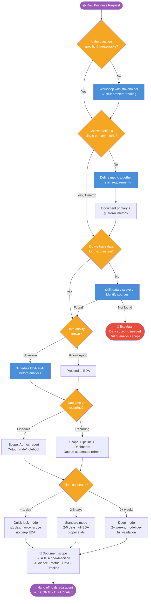
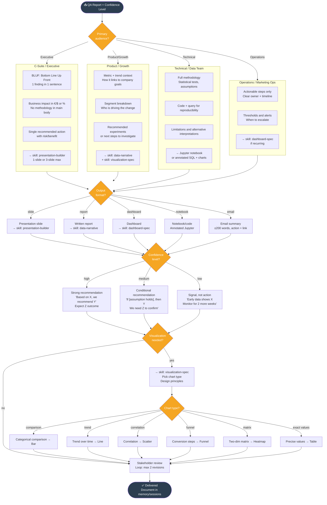
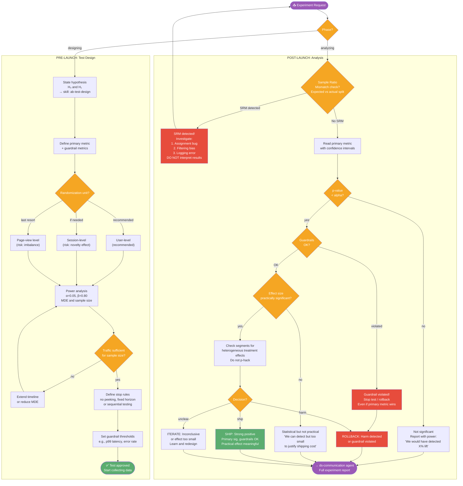

# DS Decision Trees — Complete Workflow Reference

All decision processes a senior Data Scientist makes in business/marketing/product context.
Each flowchart is a standalone sub-routine invoked by the Master Orchestrator or its agents.

---

## DT-1: Intake & Problem Framing

*Run when the business question is ambiguous, missing a success metric, or the scope is unclear.*



---

## DT-2: EDA & Data Quality

*Run by ds-eda agent. Gates analysis on data fitness.*

```mermaid
flowchart TD
    IN(["📥 Dataset + Context Package"])

    SHAPE["Shape check\n→ rows, cols, dtypes\n→ expected vs actual"]
    Q_SHAPE{"Shape in\nexpected range?"}
    INVESTIGATE_SHAPE["Investigate extraction\nCheck query/filter\nDocument discrepancy"]

    DTYPE["Type validation\nAll columns correct dtype?"]
    Q_DTYPE{"Types correct?"}
    FIX_TYPES["Fix types or flag\nDocument assumptions"]

    MISSING["Missing value scan\n% per column + pattern"]
    Q_MISSING{"Missing %?"}
    NOTE_MISSING["Note <5% — proceed\nimpute or drop in analysis"]
    IMPUTE["5-30%: MCAR/MAR/MNAR\nChoose imputation strategy\n→ skill: data-quality-audit"]
    FLAG_MISSING["30%+: Flag as risk\nConsider excluding variable\nInform stakeholder"]

    OUTLIER["Outlier detection\nIQR + domain knowledge"]
    Q_OUTLIER{"Outlier cause?"}
    DATA_ERROR["Data pipeline error\n→ Flag + fix at source\nExclude with doc"]
    REAL_SIGNAL["Real business signal\n→ Keep + annotate\ninvestigate separately"]

    DIST["Distribution check\nPlot histograms\nSkewness + kurtosis"]
    Q_DIST{"Distribution\nshape?"}
    PARAM["→ Parametric tests valid\nt-test, ANOVA, Pearson"]
    NONPARAM["→ Use non-parametric\nor log-transform\nMann-Whitney, Spearman"]
    BIMODAL["→ Investigate segments\nPossibly two populations\n→ skill: segmentation"]

    TIME["Time dimension check\nif date column exists"]
    Q_TIME{"Time series\ndata?"}
    SEASONALITY["Check seasonality\ntrends, data freshness\nperiodic patterns"]

    BIZ_RULES["Business rules validation\nRevenue ≥ 0, valid dates\ndomain-specific checks"]
    Q_BIZ{"Rules\nviolated?"}
    FLAG_BIZ["Flag violations\nQuantify impact\nDecide: exclude or fix"]

    Q_FIT{"Data fitness\nfor analysis?"}
    EDA_REPORT["📊 EDA Report\ncaveats + recommendations"]
    HANDOFF_ANALYSIS(["→ ds-analysis agent"])
    HANDOFF_BACK(["→ Back to ds-intake\nrescope or new data"])

    IN --> SHAPE
    SHAPE --> Q_SHAPE
    Q_SHAPE -->|"No — mismatch"| INVESTIGATE_SHAPE
    Q_SHAPE -->|"Yes"| DTYPE
    INVESTIGATE_SHAPE --> DTYPE

    DTYPE --> Q_DTYPE
    Q_DTYPE -->|"No"| FIX_TYPES
    Q_DTYPE -->|"Yes"| MISSING
    FIX_TYPES --> MISSING

    MISSING --> Q_MISSING
    Q_MISSING -->|"<5%"| NOTE_MISSING
    Q_MISSING -->|"5-30%"| IMPUTE
    Q_MISSING -->|">30%"| FLAG_MISSING
    NOTE_MISSING --> OUTLIER
    IMPUTE --> OUTLIER
    FLAG_MISSING --> OUTLIER

    OUTLIER --> Q_OUTLIER
    Q_OUTLIER -->|"Error"| DATA_ERROR
    Q_OUTLIER -->|"Signal"| REAL_SIGNAL
    Q_OUTLIER -->|"Unknown"| REAL_SIGNAL
    DATA_ERROR --> DIST
    REAL_SIGNAL --> DIST

    DIST --> Q_DIST
    Q_DIST -->|"Normal"| PARAM
    Q_DIST -->|"Skewed"| NONPARAM
    Q_DIST -->|"Bimodal"| BIMODAL
    PARAM --> TIME
    NONPARAM --> TIME
    BIMODAL --> TIME

    TIME --> Q_TIME
    Q_TIME -->|"Yes"| SEASONALITY
    Q_TIME -->|"No"| BIZ_RULES
    SEASONALITY --> BIZ_RULES

    BIZ_RULES --> Q_BIZ
    Q_BIZ -->|"Yes"| FLAG_BIZ
    Q_BIZ -->|"No"| Q_FIT
    FLAG_BIZ --> Q_FIT

    Q_FIT -->|"Fit (with caveats)"| EDA_REPORT
    Q_FIT -->|"Not fit"| HANDOFF_BACK
    EDA_REPORT --> HANDOFF_ANALYSIS

    classDef decision fill:#F5A623,color:#fff
    classDef action fill:#4A90D9,color:#fff
    classDef flag fill:#E74C3C,color:#fff
    classDef endpoint fill:#9B59B6,color:#fff
    class Q_SHAPE,Q_DTYPE,Q_MISSING,Q_OUTLIER,Q_DIST,Q_TIME,Q_BIZ,Q_FIT decision
    class SHAPE,DTYPE,MISSING,OUTLIER,DIST,TIME,BIZ_RULES,SEASONALITY action
    class DATA_ERROR,FLAG_MISSING,FLAG_BIZ flag
    class IN,HANDOFF_ANALYSIS,HANDOFF_BACK endpoint
```



---

## DT-3: Analysis Track Selection

*Run by ds-analysis agent. Routes to the right methodology.*

```mermaid
flowchart TD
    IN(["📥 EDA Report + Track Assignment"])

    Q_TRACK{"Analysis track?"}

    DESC_START["DESCRIPTIVE TRACK\nWhat happened?"]
    DIAG_START["DIAGNOSTIC TRACK\nWhy did it happen?"]
    PRED_START["PREDICTIVE TRACK\nWhat will happen?"]
    PRES_START["PRESCRIPTIVE TRACK\nWhat should we do?"]
    DASH_START["DASHBOARD TRACK\nRecurring monitoring"]

    subgraph DESCRIPTIVE ["📊 Descriptive Sub-routine"]
        D1{"What\ngranularity?"}
        D_OVERALL["Overall metrics\n→ skill: metrics-snapshot"]
        D_COHORT["By cohort/time\n→ skill: cohort-analysis"]
        D_FUNNEL["By conversion step\n→ skill: funnel-analysis"]
        D_TREND["Over time\n→ skill: time-series-descriptive"]
        D2{"Comparison\nbaseline?"}
        D_YOY["Year-over-year"]
        D_WOW["Week-over-week"]
        D_TARGET["vs Target/Plan"]
        D_BENCH["vs Benchmark/Competitor"]
    end

    subgraph DIAGNOSTIC ["🔍 Diagnostic Sub-routine"]
        DG1{"Control group\navailable?"}
        DG_CAUSAL["Causal analysis\n→ skill: causal-check\nDiff-in-diff, RDD"]
        DG_OBS["Observational only\nFlag correlation ≠ causation\n→ skill: root-cause"]
        DG2{"Change type?"}
        DG_SUDDEN["Sudden drop/spike\n→ skill: drill-down\nTime-point investigation"]
        DG_TREND["Gradual trend\n→ skill: segmentation\nWho drove the change?"]
        DG_MIXED["Mixed pattern\nBoth drill-down + segmentation"]
    end

    subgraph PREDICTIVE ["🔮 Predictive Sub-routine"]
        PR1{"Prediction\nhorizon?"}
        PR_SHORT["Short-term <3mo\n→ skill: forecasting\nARIMA/Prophet/ETS"]
        PR_LONG["Long-term 3mo+\n→ skill: regression-modeling\nML features needed"]
        PR2{"Interpretability\nrequired?"}
        PR_INTERPRET["Yes → Linear/LogReg/DT\nExplainable coefficients"]
        PR_PERFORM["No → XGBoost/LGBM/NN\nMaximize accuracy"]
        PR3{"Churn/binary\noutcome?"}
        PR_CHURN["→ skill: churn-prediction\nBinary classifier"]
    end

    subgraph PRESCRIPTIVE ["⚙️ Prescriptive Sub-routine"]
        PS1{"Can we run\nan experiment?"}
        PS_DESIGN["→ skill: ab-test-design\nPower calc, randomization"]
        PS2{"Existing\nexperiment data?"}
        PS_ANALYSIS["→ skill: ab-test-analysis\nStat significance, SRM check"]
        PS3{"No experiment\npossible?"}
        PS_OPT["→ skill: optimization-framing\nBayesian, bandit, rule-based"]
        PS4{"Min detectable\neffect feasible?"}
        PS_POWER["Insufficient power\nExtend test or\nreframe question"]
    end

    subgraph DASHBOARD ["📈 Dashboard Sub-routine"]
        DB1{"Audience?"}
        DB_EXEC["Executive\n→ 5 KPIs max\ntraffic-light status"]
        DB_PRODUCT["Product/Growth\n→ funnel + cohort\nweekly refresh"]
        DB_OPS["Operations\n→ granular + alerts\ndaily refresh"]
        DB_SPEC["→ skill: dashboard-spec\nDefine metrics, refresh, owner"]
    end

    IN --> Q_TRACK
    Q_TRACK -->|descriptive| DESC_START
    Q_TRACK -->|diagnostic| DIAG_START
    Q_TRACK -->|predictive| PRED_START
    Q_TRACK -->|prescriptive| PRES_START
    Q_TRACK -->|dashboard| DASH_START

    DESC_START --> D1
    D1 -->|overall| D_OVERALL
    D1 -->|by segment| D_COHORT
    D1 -->|by step| D_FUNNEL
    D1 -->|over time| D_TREND
    D_OVERALL --> D2
    D_COHORT --> D2
    D_FUNNEL --> D2
    D_TREND --> D2
    D2 --> D_YOY & D_WOW & D_TARGET & D_BENCH

    DIAG_START --> DG1
    DG1 -->|Yes| DG_CAUSAL
    DG1 -->|No| DG_OBS
    DG_CAUSAL --> DG2
    DG_OBS --> DG2
    DG2 -->|sudden| DG_SUDDEN
    DG2 -->|gradual| DG_TREND
    DG2 -->|both| DG_MIXED

    PRED_START --> PR1
    PR1 -->|short| PR_SHORT
    PR1 -->|long| PR_LONG
    PR1 -->|binary outcome| PR3
    PR3 -->|yes| PR_CHURN
    PR_SHORT --> PR2
    PR_LONG --> PR2
    PR2 -->|yes| PR_INTERPRET
    PR2 -->|no| PR_PERFORM

    PRES_START --> PS1
    PS1 -->|yes, design new| PS_DESIGN
    PS1 -->|yes, analyze existing| PS2
    PS1 -->|no| PS3
    PS2 --> PS_ANALYSIS
    PS3 --> PS_OPT
    PS_DESIGN --> PS4
    PS4 -->|feasible| PRES_END(["→ ds-qa agent"])
    PS4 -->|not feasible| PS_POWER

    DASH_START --> DB1
    DB1 --> DB_EXEC & DB_PRODUCT & DB_OPS
    DB_EXEC --> DB_SPEC
    DB_PRODUCT --> DB_SPEC
    DB_OPS --> DB_SPEC

    classDef decision fill:#F5A623,color:#fff
    classDef desc fill:#5BAD6F,color:#fff
    classDef diag fill:#4A90D9,color:#fff
    classDef pred fill:#9B59B6,color:#fff
    classDef pres fill:#E67E22,color:#fff
    classDef dash fill:#1ABC9C,color:#fff
    class Q_TRACK,D1,D2,DG1,DG2,PR1,PR2,PR3,PS1,PS2,PS3,PS4,DB1 decision
```



---

## DT-4: Validation & QA

*Run by ds-qa agent on any analysis before communication.*

```mermaid
flowchart TD
    IN(["📥 Analysis Output"])

    SMELL{"Smell test:\nResult directionally\nsensible for the business?"}
    RECHECK["Recheck:\n1. Data extraction\n2. Metric definition\n3. Filter logic\n→ skill: sanity-check"]

    STAT_SIG{"Statistical\nsignificance\nachieved?"}
    REPORT_UNCERTAIN["Report with uncertainty\nConfidence intervals\nDo not overstate"]
    POWER{"Was analysis\nproperly powered?"}
    POWER_NOTE["Note power gap\nProvide point estimate\nwith wide CI"]

    ASSUMPTIONS{"Core assumptions\nmet?"}
    ASSUMPTION_LIST["Check:\n• Independence\n• Normality (if parametric)\n• Homoscedasticity\n• No multicollinearity (regression)\n• No autocorrelation (time series)"]
    ROBUST["Switch to robust method\nor transform + rerun\n→ skill: assumptions-log"]
    DOCUMENT_ASSUME["Document which assumptions\nwere violated + impact"]

    CONFOUNDERS{"Obvious confounders\nchecked?"}
    CONFOUNDER_LIST["Check:\n• Seasonality\n• External events (holidays, news)\n• Data pipeline changes\n• Sample composition shift\n→ skill: causal-check"]
    ADD_CAVEAT["Add caveat to output\n'Results may be influenced by X'"]

    SIMPLE{"Is there a simpler\nexplanation for the result?"]
    OCCAM["Investigate simpler hypothesis\nbefore concluding complex cause"]

    STAKES{"Decision stakes?"}
    PEER["High stakes: peer review\n→ skill: peer-review\nSecond pair of eyes required"]
    SELF_REVIEW["Standard: self-review\n→ skill: qa-checklist"]

    CONF_LEVEL{"Confidence level\nof finding?"}
    HIGH["HIGH: recommend action\n'We recommend X'"]
    MEDIUM["MEDIUM: present options\n'Evidence suggests X,\nneed Y to confirm'"]
    LOW["LOW: gather more data\n'Early signal, not actionable yet'"]

    QA_REPORT["📋 QA Report\n→ findings + confidence + caveats"]
    COMM_HANDOFF(["→ ds-communication agent"])
    BACK_ANALYSIS(["→ ds-analysis agent\nrevise methodology"])

    IN --> SMELL
    SMELL -->|Yes, sensible| STAT_SIG
    SMELL -->|No, suspicious| RECHECK
    RECHECK -->|Fixed| STAT_SIG
    RECHECK -->|Structural issue| BACK_ANALYSIS

    STAT_SIG -->|Yes| ASSUMPTIONS
    STAT_SIG -->|No| POWER
    POWER -->|Was powered, just no sig| REPORT_UNCERTAIN
    POWER -->|Was underpowered| POWER_NOTE
    REPORT_UNCERTAIN --> ASSUMPTIONS
    POWER_NOTE --> ASSUMPTIONS

    ASSUMPTIONS --> ASSUMPTION_LIST
    ASSUMPTION_LIST -->|All met| CONFOUNDERS
    ASSUMPTION_LIST -->|Violated| ROBUST
    ROBUST -->|Can fix| ASSUMPTIONS
    ROBUST -->|Cannot fix| DOCUMENT_ASSUME
    DOCUMENT_ASSUME --> CONFOUNDERS

    CONFOUNDERS -->|Checked, none| SIMPLE
    CONFOUNDERS -->|Found confounders| CONFOUNDER_LIST
    CONFOUNDER_LIST --> ADD_CAVEAT --> SIMPLE

    SIMPLE -->|No simpler explanation| STAKES
    SIMPLE -->|Simpler explanation exists| OCCAM
    OCCAM --> BACK_ANALYSIS

    STAKES -->|High stakes| PEER
    STAKES -->|Standard| SELF_REVIEW
    PEER --> CONF_LEVEL
    SELF_REVIEW --> CONF_LEVEL

    CONF_LEVEL -->|High| HIGH
    CONF_LEVEL -->|Medium| MEDIUM
    CONF_LEVEL -->|Low| LOW

    HIGH --> QA_REPORT
    MEDIUM --> QA_REPORT
    LOW --> QA_REPORT
    QA_REPORT --> COMM_HANDOFF

    classDef decision fill:#F5A623,color:#fff
    classDef action fill:#4A90D9,color:#fff
    classDef fix fill:#E74C3C,color:#fff
    classDef outcome fill:#5BAD6F,color:#fff
    classDef endpoint fill:#9B59B6,color:#fff
    class SMELL,STAT_SIG,POWER,ASSUMPTIONS,CONFOUNDERS,SIMPLE,STAKES,CONF_LEVEL decision
    class ASSUMPTION_LIST,CONFOUNDER_LIST,SELF_REVIEW,PEER action
    class RECHECK,ROBUST,OCCAM fix
    class HIGH,MEDIUM,LOW outcome
    class IN,COMM_HANDOFF,BACK_ANALYSIS endpoint
```

---

## DT-5: Communication & Delivery

*Run by ds-communication agent. Matches output format to audience.*



---

## DT-6: Predictive / Modeling Sub-routine

*Run by ds-modeling agent for predictive and prescriptive tracks.*

```mermaid
flowchart TD
    IN(["📥 Modeling Request + EDA Report"])

    Q_PROB{"Problem type?"}
    REGRESSION["Regression\n(continuous output)"]
    CLASSIFICATION["Classification\n(binary/multi-class)"]
    CLUSTERING["Clustering\n(unsupervised segments)"]
    TS["Time series forecast"]

    Q_DATA_VOL{"Data volume?"}
    SMALL["<10K rows\nSimple models first\nno overfitting risk"]
    MEDIUM["10K-1M rows\nFull ML pipeline\ncross-validation"]
    LARGE[">1M rows\nBatch processing\npossibly distributed"]

    Q_FEATURES{"Feature engineering\nneeded?"}
    FEAT_ENG["→ skill: regression-modeling\nlag features, rolling stats\nencoding, interaction terms"]
    USE_AS_IS["Use raw features\nwith normalization"]

    Q_INTERPRETABLE{"Interpretability\nrequired?"}
    LINEAR_FAMILY["Linear / Logistic Reg\nDecision Tree\nCoefficients matter"]
    TREE_FAMILY["XGBoost / LGBM\nRandom Forest\nSHAP for explanation"]

    BASELINE["Always fit baseline first\nMean prediction / majority class\nnaive seasonal (time series)"]

    Q_BASELINE_OK{"Model beats\nbaseline?"]
    BASELINE_FAIL["Investigate:\n1. Feature quality\n2. Label quality\n3. Model selection\n4. Hyperparams"]

    VALID_STRAT["Validation strategy\nTime series → forward-walk CV\nOther → stratified k-fold"]

    Q_OVERFIT{"Train vs Val\ngap > 10%?"}
    REGULARIZE["Regularize:\nReduce features\nIncrease dropout\nL1/L2 penalty"]

    METRICS_CHECK["Choose eval metric\nRegression: RMSE, MAE, MAPE\nClassification: AUC, F1, Precision@K\nForecast: MAPE, SMAPE, coverage"]

    Q_DEPLOY{"Model to\nbe deployed?"}
    MODEL_CARD["→ skill: model-card\nInputs, outputs, limitations\nmonitoring plan"]
    INSIGHT_ONLY["Document as\nanalysis artifact\nno deployment"]

    QA_MODEL(["→ ds-qa agent\nModel validation"])

    IN --> Q_PROB
    Q_PROB -->|numeric output| REGRESSION
    Q_PROB -->|category output| CLASSIFICATION
    Q_PROB -->|find groups| CLUSTERING
    Q_PROB -->|future values| TS

    REGRESSION & CLASSIFICATION & CLUSTERING & TS --> Q_DATA_VOL
    Q_DATA_VOL --> SMALL & MEDIUM & LARGE

    SMALL & MEDIUM & LARGE --> Q_FEATURES
    Q_FEATURES -->|yes| FEAT_ENG
    Q_FEATURES -->|no| USE_AS_IS

    FEAT_ENG & USE_AS_IS --> BASELINE
    BASELINE --> Q_BASELINE_OK
    Q_BASELINE_OK -->|no| BASELINE_FAIL
    Q_BASELINE_OK -->|yes| Q_INTERPRETABLE
    BASELINE_FAIL --> Q_INTERPRETABLE

    Q_INTERPRETABLE -->|yes| LINEAR_FAMILY
    Q_INTERPRETABLE -->|no| TREE_FAMILY

    LINEAR_FAMILY & TREE_FAMILY --> VALID_STRAT
    VALID_STRAT --> Q_OVERFIT
    Q_OVERFIT -->|yes| REGULARIZE
    Q_OVERFIT -->|no| METRICS_CHECK
    REGULARIZE --> METRICS_CHECK

    METRICS_CHECK --> Q_DEPLOY
    Q_DEPLOY -->|yes| MODEL_CARD
    Q_DEPLOY -->|no| INSIGHT_ONLY
    MODEL_CARD & INSIGHT_ONLY --> QA_MODEL

    classDef decision fill:#F5A623,color:#fff
    classDef problem fill:#9B59B6,color:#fff
    classDef action fill:#4A90D9,color:#fff
    classDef warning fill:#E74C3C,color:#fff
    classDef endpoint fill:#2C3E50,color:#fff
    class Q_PROB,Q_DATA_VOL,Q_FEATURES,Q_INTERPRETABLE,Q_BASELINE_OK,Q_OVERFIT,Q_DEPLOY decision
    class REGRESSION,CLASSIFICATION,CLUSTERING,TS problem
    class BASELINE_FAIL,REGULARIZE warning
    class IN,QA_MODEL endpoint
```

---

## DT-7: A/B Test — Design & Analysis Combined

*Run within Prescriptive track. Two phases: design before running, analysis after.*


